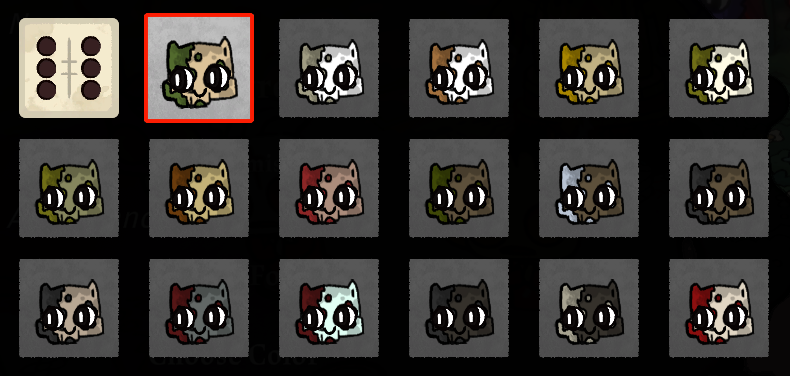

Adds an Zombie follower form to Cult of the Lamb, based on the in-game asset of the rotting corpse.
With the help of [Possum Follower Template](https://cult-of-the-lamb.thunderstore.io/package/KellyBetty/PossumFollower/).

## Installation
This mod’s dependencies are BepInEx, COTL_API and COTL_JSONLoader.

#### Installation (Mod Manager)
1. Download and install [r2modman](https://thunderstore.io/package/ebkr/r2modman/) or the [Thunderstore Mod Manager](https://www.overwolf.com/app/Thunderstore-Thunderstore_Mod_Manager).
2. Install this mod and all of its dependencies with the help of the mod manager! 

#### Installation (Manual)
1. Download and install [BepInExPack CultOfTheLamb](https://cult-of-the-lamb.thunderstore.io/package/BepInEx/BepInExPack_CultOfTheLamb/).
2. Download and install the [COTL API](https://cult-of-the-lamb.thunderstore.io/package/xhayper/COTL_API/).
3. Download and install the [COTL JSONLoader](https://cult-of-the-lamb.thunderstore.io/package/KellyBetty/COTL_JSONLoader/).
4. Place the contents of **"ZombieFollower.zip"** in its own folder within the BepInEx/plugins folder.
